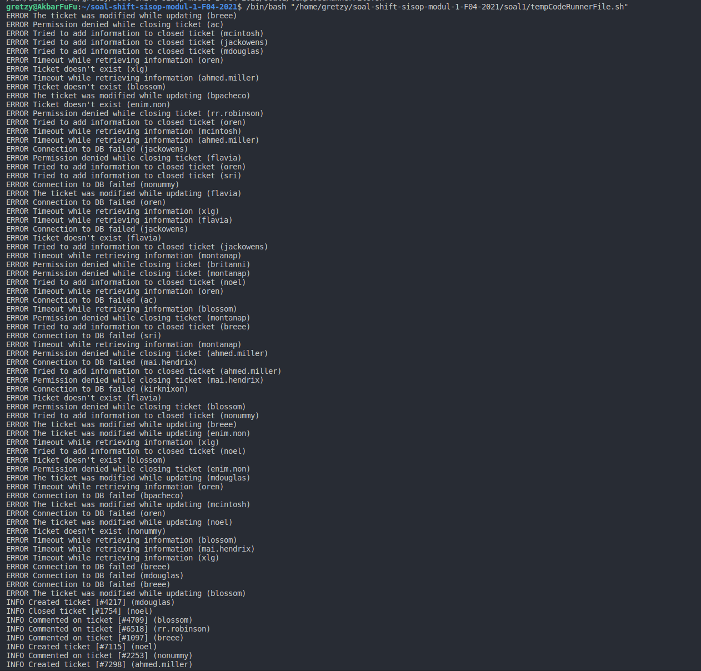
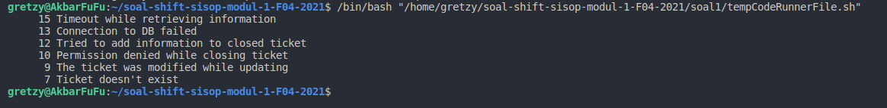
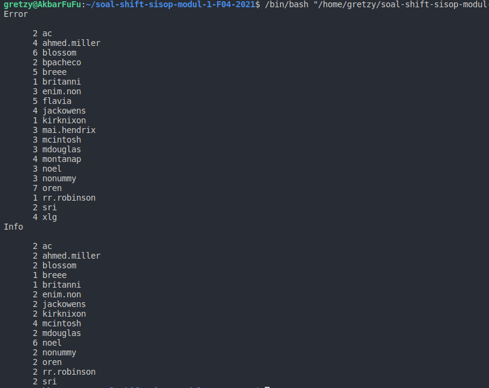

# soal-shift-sisop-modul-1-F04-2021

## Anggota Kelompok
- **Thomas Dwi Awaka** (05111940000021)
- **Muhammad Arifiansyah** (05111940000027)
- **Muhammad Rizqullah Akbar** (05111940000178)

# Pembahasan Soal
## Soal 1
### Soal 1A
Pada soal ini kita harus menampilkan informasi dari syslog.log yang berisikan **_Jenis Log, Pesan Log dan Username_**.
```bash
grep -o 'ERROR.*' /home/gretzy/soal-shift-1-local/soal1/syslog.log
grep -o 'INFO.*' /home/gretzy/soal-shift-1-local/soal1/syslog.log
```
Kita mencari informasi yang dibutuhkan dengan menggunakan `grep` dimana `-o 'ERROR.*'` adalah setiap kalimat pada sebuah line yang mengandung kata **ERROR** diawalnya. Begitu juga dengan **INFO**.



#### Kendala
Kesulitan untuk melakukan operasi file tanpa *AWK* dan juga pencarian kata menggunakan *REGEXP*.
### Soal 1B
Pada soal ini kita harus menampilkan informasi **Jumlah Jenis ERROR yang muncul**.
```bash
grep -o 'Time.*information' /home/gretzy/soal-shift-1-local/soal1/syslog.log | uniq -c
grep -o 'Connect.*failed' /home/gretzy/soal-shift-1-local/soal1/syslog.log | uniq -c
grep -o 'Tried.*ticket' /home/gretzy/soal-shift-1-local/soal1/syslog.log | uniq -c
grep -o 'Permission.*ticket' /home/gretzy/soal-shift-1-local/soal1/syslog.log | uniq -c
grep -o 'The.*updating' /home/gretzy/soal-shift-1-local/soal1/syslog.log | uniq -c
grep -o 'Ticket.*exist' /home/gretzy/soal-shift-1-local/soal1/syslog.log | uniq -c
```
Masih menggunakan `grep` kita mencari tiap jenis error dengan `-o 'Time.*information'` dimana mencari kalimat pada sebuah line yang diawali *Time* dan diakihiri *information*. Begitu juga untuk jenis ERROR lainnya.



#### Kendala
Kesulitan untuk melakukan perhitungan tiap jenis *ERROR*, solusinya menggunakan `uniq -c`.

### Soal 1C
Pada soal ini kita harus menampilkan informasi **Berapa kali tiap user mendapati ERROR dan INFO**.
```bash
echo -e "Error \n"
grep -o 'ERROR.*' /home/gretzy/soal-shift-1-local/soal1/syslog.log > /home/gretzy/listerror.log
grep -o '(.*)' /home/gretzy/listerror.log | tr -d ')' | tr -d '('| sort | uniq -c

echo -e "Info \n"
grep -o 'INFO.*' /home/gretzy/soal-shift-1-local/soal1/syslog.log > /home/gretzy/listinfo.log
grep -o '(.*)' /home/gretzy/listinfo.log | tr -d ')' | tr -d '('| sort | uniq -c
```
Pertama kita mencari setiap jenis *ERROR* dan *INFO* sama seperti Soal 1A dan menyimpannya pada sebuah file. Lalu menggunakan `-o '(.*)'` untuk mendapat informasi nama user. Lalu kita *truncate* yang tidak diperlukan. Selanjutnya kita `sort` dan menghitung kemunculan tiap user dengan `uniq -c`.



#### Kendala
Kesulitan untuk memisahkan *ERROR* dan *INFO*, solusinya ditaruh disebuah file terelbih dahulu.

## Soal 2
### Soal 2A
Soal ini ingin mencari **jumlah _profit percentage terbesar_** dan **Row _ID_** 
```bash
#!/bin/bash
awk 'BEGIN { FS="\t"; ORS="\r\n"; max=0; ID=0 } 
{ 
        cost=$18-$21;
        if(cost>0)
                profit=($21/cost)*100;
        else
                profit=0;
	if(profit>=max) {ID=$1; max=profit;} } 
END{print "Transaksi terakhir dengan profit percentage terbesar yaitu " ID "\ndengan persentase " max  "%."}' /home/gretzy/soal-shift-1-local/soal2/Laporan-TokoShiSop.tsv >> /home/gretzy/soal-shift-sisop-modul-1-F04-2021/soal2/hasil.txt
```
Untuk mencari profit percentage dan ID, maka perlu memisahkan setiap kolom dari data yang telah disediakan dan mulai mencari data sesuai dengan soal yang diberikan. Pertama, variabel ``max`` dan ``ID`` di set 0 sebagai inisiasi.
```awk
awk 'BEGIN { FS="\t"; OFS=","; ORS="\r\n" } 
```
_Command_ diatas mencari _File Separator_ dari file ```.tsv``` yang telah disediakan (yaitu tab atau "\t") dan merubah _Output File Separator_ dengan tanda koma (",") serta untuk _Output Record Separtor_ diatur agar setiap field diberi newline.
```awk
cost=$18-$21;
        if(cost>0)
                profit=($21/cost)*100;
        else
                profit=0;
if(profit>=max) {ID=$1; max=profit;} } 
```
Cara untuk mencari profit dan ID ialah dengan menggunakan rumus yang tertera pada soal dan membandingkannya pada setiap field, namun harus dicek pembagi tidak boleh 0. Jika memenuhi kondisi if tersebut, maka program akan menyimpan nilai profit dan ID tersebut.
```awk
END{print "Transaksi terakhir dengan profit percentage terbesar yaitu " ID "\ndengan persentase " max*100  "%."}' 
/home/gretzy/soal-shift-1-local/soal2/Laporan-TokoShiSop.tsv > /home/gretzy/soal-shift-sisop-modul-1-F04-2021/soal2/hasil.txt
```
Diakhir program akan mencetak output seperti yang diminta dan menyimpan output tersebut ke ```hasil.txt```

#### Kendala
Kesulitan karena ada error jika pembagi dari formula yang diberikan sama dengan 0. Sehingga hasil tidak akurat.

### Soal 2B
Pada soal ini kita mencari **Nama customer yang melakukan transaksi pada tahun _2017_ di _Albuquerque_**.
```bash
awk 'BEGIN { print "\nDaftar nama customer di Albuquerque pada tahun 2017 antara lain:" ; FS="\t"; OFS=","; ORS="\r\n"} 
{split($3, tglArr, "-"); if (tglArr[3] == 17 && $10 == "Albuquerque") print $7  }  ' /home/gretzy/soal-shift-1-local/soal2/Laporan-TokoShiSop.tsv | uniq >> /home/gretzy/soal-shift-sisop-modul-1-F04-2021/soal2/hasil.txt
```
Menggunakan fungsi `split` kita bisa mengambil informasi tahunnya saja dari tanggal. Lalu menggunakan `uniq` agar tidak ada redundan pada output yang diberikan.

#### Kendala
Kesulitan karena data yang dibutuhkan dari tanggal hanya tahunnya, sehingga harus menggunakan fungsi `split`.

### Soal 2C
Pada soal ini kita mencari **Segmen dengan penjualan _paling sedikit_ dan jumlah transaksinya**
```bash
Consumer=0
Corporate=0
HomeOffice=0
top=0
segment="kosong"

awk 'BEGIN { FS="\t"; OFS=","; ORS="\r\n" } {
if($8=="Consumer"){
        Consumer=(Consumer+1)
    }
else if($8=="Corporate"){
        Corporate=(Corporate+1)
    }
else if($8=="Home Office"){
        HomeOffice=(HomeOffice+1)
    }
}

END{
if(Consumer<Corporate&&Consumer<HomeOffice){
        segment="Consumer"
        top=Consumer
        }
else if(Corporate<Consumer&&Corporate<HomeOffice){
        segment="Corporate"
        top=Corporate
        }
else if(HomeOffice<Consumer&&HomeOffice<Corporate){
        segment="Home Office"
        top=HomeOffice
        }
print "\nTipe segmen customer yang penjualannya paling sedikit adalah " segment "\ndengan " top " transaksi."
}' /home/gretzy/soal-shift-1-local/soal2/Laporan-TokoShiSop.tsv >> /home/gretzy/soal-shift-sisop-modul-1-F04-2021/soal2/hasil.txt
```
Pertama kita melakukan perhitungan dari transaksi yang berlangsung pada tiap segmennya. Lalu akan mengecek mana yang paling kecil dan menjadikannya sebagai output.

### Soal 2D
Pada soal ini kita mencari **Region dengan keuntungan _paling sedikit_ dan juga berapa keuntungannya**. Variabel **South,West,East,Central** tersebut digunakan untuk menyimpan total profit region tersebut. Kemudian **min** kita gunakan untuk menyimpan **profit region terlendah** & **Wilayah** untuk menyimpan **nama region terendah**
```bash
#!/bin/bash

South=0
West=0
East=0
Central=0;
min=0
Wilayah="a"

awk 'BEGIN { FS="\t"; OFS=","; ORS="\r\n" } {
if($13=="South")South=South+$21;
else if($13=="West")West=West+$21;
else if($13=="East")East=East+$21;
else if($13=="Central")Central=Central+$21;
}
END{
if(West<South&&West<East&&West<Central){
        Wilayah="West"
        min=West
        }
else if(South<West&&South<East&&South<Central){
        Wilayah="South"
        min=South
        }
else if(East<South&&East<West&&East<Central){
        Wilayah="East"
        min=East
        }
else if(Central<South&&Central<West&&Central<East){
        Wilayah="Central"
        min=Central
        }
print "\nWilayah bagian (region) yang memiliki total keuntungan (profit) yang\npaling sedikit adalah " Wilayah " dengan total keuntungan " min
}' Laporan-TokoShiSop.tsv >> hasil.txt                                                              
```
Pertama-tama dilalukakan perhitungan nilai dengan **if else** apabila **13=="nama_region"** maka profit tersebut ditambahkan ke region yang memenuhi seleksi tadi.  
```bash
South=0
West=0
East=0
Central=0;
min=0
Wilayah="a"

awk 'BEGIN { FS="\t"; OFS=","; ORS="\r\n" } {
if($13=="South")South=South+$21;
else if($13=="West")West=West+$21;
else if($13=="East")East=East+$21;
else if($13=="Central")Central=Central+$21;
}
```
Setelah itu dibuat if else untuk menyeleksi ,apabila **region a < region b && region a < region c && region a < region d** maka region a tersebut yang **kita akan tampilkan nama dan profitnya**
```bash
END{
if(West<South&&West<East&&West<Central){
        Wilayah="West"
        min=West
        }
else if(South<West&&South<East&&South<Central){
        Wilayah="South"
        min=South
        }
else if(East<South&&East<West&&East<Central){
        Wilayah="East"
        min=East
        }
else if(Central<South&&Central<West&&Central<East){
        Wilayah="Central"
        min=Central
        }
print "\nWilayah bagian (region) yang memiliki total keuntungan (profit) yang\npaling sedikit adalah " Wilayah " dengan total keuntungan " min
```


### Soal 2E
Menampilkan output pada file hasil.txt
```
Transaksi terakhir dengan profit percentage terbesar yaitu 9952
dengan persentase 100%.

Daftar nama customer di Albuquerque pada tahun 2017 antara lain:
Michelle Lonsdale
Benjamin Farhat
David Wiener
Susan Vittorini

Tipe segmen customer yang penjualannya paling sedikit adalah Home Office
dengan 1783 transaksi.

Wilayah bagian (region) yang memiliki total keuntungan (profit) yang
paling sedikit adalah Central dengan total keuntungan 39706.4

```
## Soal 3
### Soal 3a
Soal ini diminta membuat script untuk **Mengunduh** foto pada link yang diberikan, **Menyimpan Log**, dan **menghapus** foto yang sama.

```bash
#!/bin/bash

mkdir /home/gretzy/$(date +%d-%m-%Y)

count=1
while [ $count -lt 10 ]
do
    wget https://loremflickr.com/320/240/kitten -O Koleksi_0$count 2>> /home/gretzy/$(date +%d-%m-%Y)/Foto.log
    let count=count+1
done

while [ $count -le 23 ]
do
    wget https://loremflickr.com/320/240/kitten -O Koleksi_$count 2>> /home/gretzy/$(date +%d-%m-%Y)/Foto.log
    let count=count+1
done

fdupes -N -d /home/gretzy/soal-shift-sisop-modul-1-F04-2021/
```
Pada awalnya script akan membuat folder dengan ```mkdir``` untuk menjadi direktori penyimpanan gambar
```bash
mkdir /home/gretzy/$(date +%d-%m-%Y)
```
Kemudian dengan ```while```, script akan mulai mengunduh sebanyak 23 foto. Terdapat 2 pengulangan dimana pengulangan pertama yaitu dari satu sampai sembilan dan yang kedua yaitu dari 10 hingga 23. Pengulangan tersebut dilakukan untuk menyimpan foto yang telah diunduh dengan format nama yang telah ditentukan
```bash
count=1
while [ $count -lt 10 ]
do
    wget https://loremflickr.com/320/240/kitten -O Koleksi_0$count 2>> /home/gretzy/$(date +%d-%m-%Y)/Foto.log
    let count=count+1
done

while [ $count -le 23 ]
do
    wget https://loremflickr.com/320/240/kitten -O Koleksi_$count 2>> /home/gretzy/$(date +%d-%m-%Y)/Foto.log
    let count=count+1
done
```
Karena ada kemungkinan foto yang diunduh merupakan foto yang sama, maka perlu menghapus foto yang duplikat dengan menggunakan ```fdupes```
```bash
fdupes -N -d /home/gretzy/soal-shift-sisop-modul-1-F04-2021/
```
### Soal 3b
Penyelesaian untuk soal ini mirip dengan soal 3a, tetapi foto yang diunduh harus dipindahkan ke folder yang diminta dan membuat jadwal untuk menjalankan script tersebut
```bash
#!/bin/bash

mkdir /home/gretzy/$(date +%d-%m-%Y)

count=1
while [ $count -lt 10 ]
do
    wget https://loremflickr.com/320/240/kitten -O Koleksi_0$count 2>> /home/gretzy/$(date +%d-%m-%Y)/Foto.log
    mv Koleksi_0$count /home/gretzy/$(date +%d-%m-%Y)
    let count=count+1
done

while [ $count -le 23 ]
do
    wget https://loremflickr.com/320/240/kitten -O Koleksi_$count 2>> /home/gretzy/$(date +%d-%m-%Y)/Foto.log
    mv Koleksi_$count /home/gretzy/$(date +%d-%m-%Y)
    let count=count+1
done

fdupes -N -d /home/gretzy/$(date +%d-%m-%Y)
```
Karena harus memindahkan ke foldere yang diminta, maka script diberi tambahan _command_ ```mv```
```bash
mv Koleksi_0$count /home/gretzy/$(date +%d-%m-%Y)
```
dan
```bash
mv Koleksi_$count /home/gretzy/$(date +%d-%m-%Y)
```
Untuk membuat membuat jadwal seperti pada soal, dapat menggunakan crontab untuk menjalankan script yang telah dibuat.
```
0 20 1/7,2/7 * * bash /home/gretzy/soal-shift-sisop-modul-1-F04-2021/soal3/soal3b.sh
```
### Soal 3c
Soal ini ingin **mengunduh** 2 jenis foto yang berbeda(kucing dan kelinci) secara **bergantian** setiap harinya dan hasil unduhan disimpan dengan nama folder sesuai dengan jenis hewannya beserta tanggal mengunduhnya
```bash
#!/bin/bash

yesterday=$(date -d yesterday +"%d-%m-%Y")
today=$(date -d today +"%d-%m-%Y")


if [ -d /home/gretzy/"Kelinci_$yesterday" ]
then
mkdir /home/gretzy/Kucing_$(date +%d-%m-%Y)
wget https://loremflickr.com/320/240/kitten -O Foto_Kucing  2>> /home/gretzy/Foto.log
mv Foto_Kucing /home/gretzy/Kucing_$(date +%d-%m-%Y)/Foto_Kucing_$(date +%T)
mv /home/gretzy/Foto.log /home/gretzy/Kucing_$(date +%d-%m-%Y)
else
mkdir /home/gretzy/Kelinci_$(date +%d-%m-%Y)
wget https://loremflickr.com/320/240/bunny -O Foto_Kelinci  2>> /home/gretzy/Foto.log
mv Foto_Kelinci /home/gretzy/Kelinci_$(date +%d-%m-%Y)/Foto_Kelinci_$(date +%T)
mv /home/gretzy/Foto.log /home/gretzy/Kelinci_$(date +%d-%m-%Y)
fi
```
Untuk memudahkan melakukan pengecekan terhadap jenis hewan yang telah diunduh pada hari sebelumnya, maka dilakukan inisiasi untuk tanggal hari ini dan kemarin
```bash
yesterday=$(date -d yesterday +"%d-%m-%Y")
today=$(date -d today +"%d-%m-%Y")
```
Dari ```yesterday``` maka dapat diperiksa foto jenis hewan apa yang telah diunduh pada hari sebelumnya.
```bash
if [ -d /home/gretzy/"Kelinci_$yesterday" ]
```
Kelompok kami memilih untuk memeriksa file yang telah diunduh kemarin merupakan foto kelinci atau bukan. kondisi ini masih dapat disesuaikan dengan keinginan programmernya. Jika kemarin script mengunduh foto kelinci, maka hari ini script akan mengunduh foto kucing
```bash
mkdir /home/gretzy/Kucing_$(date +%d-%m-%Y)
wget https://loremflickr.com/320/240/kitten -O Foto_Kucing  2>> /home/gretzy/Foto.log
mv Foto_Kucing /home/gretzy/Kucing_$(date +%d-%m-%Y)/Foto_Kucing_$(date +%T)
mv /home/gretzy/Foto.log /home/gretzy/Kucing_$(date +%d-%m-%Y)
```
Proses pengunduhannya dimulai dengan ```mkdir``` untuk membuat folder penyimpanan dengan format nama yang telah ditentukan (jenis hewan_tanggal). Kemudian mengunduh foto dari link yang telah disediakan dan semuanya dicatat di file ```.log```. Dan Terakhir memindahkan foto yang diunduh dan file ```.log``` kefolder yang sesuai.
```bash
else
mkdir /home/gretzy/Kelinci_$(date +%d-%m-%Y)
wget https://loremflickr.com/320/240/bunny -O Foto_Kelinci  2>> /home/gretzy/Foto.log
mv Foto_Kelinci /home/gretzy/Kelinci_$(date +%d-%m-%Y)/Foto_Kelinci_$(date +%T)
mv /home/gretzy/Foto.log /home/gretzy/Kelinci_$(date +%d-%m-%Y)
fi
```
Dan berlaku juga untuk sebaliknya, jika foto kucing yang telah diunduh kemarin maka hari ini script akan mengunduh foto kelinci dengan _command_ yang sama seperti yang sudah dijelaskan sebelumnya

### Soal 3d

Soal ini ingin **memindahkan seluruh folder ke zip** yang diberi nama “Koleksi.zip” dan *mengunci* zip tersebut dengan **password** berupa tanggal saat ini dengan format "MMDDYYYY"
```bash
#!/bin/bash
cd /.
cd /home/gretzy

today=$(date -d today +"%d-%m-%Y")

zip -rem Koleksi.zip Kucing_* Kelinci_* $(date -d today +"%d-%m-%Y") -P "$today"
```
Untuk memudahkan penulisan password, password(tanggal hari ini) dimasukkan ke variabel today. 
```bash
today=$(date -d today +"%d-%m-%Y")
```
Sebelum command dijalankan ,pindah ke directory /home/user terlebih dahulu 
```bash
cd /.
cd /home/gretzy
```
Kemudian file dengan pattern kucing dan kelinci dengan tanggal hari ini diubah formatnya menjadi zip kemudian diberi password hari ini . Kemudian file sebelumnya dihapus
```bash
zip -rem Koleksi.zip Kucing_* Kelinci_* $(date -d today +"%d-%m-%Y") -P "$today"
```
### soal 3e
Untuk Soal ini diminta untuk membuat script pada soal 3d berjalan sesuai jadwal yang diminta dan juga menjalankan perintah untuk **un-zip** file yang telah di zip dari script pada soal 3d
```
0 18 * * 1-5 unzip -P `date "+\%d-\%m-\%Y"` /home/gretzy/Koleksi.zip && rm /home/gretzy/Koleksi.zip

0 7 * * 1-5 bash ~/soal-shift-sisop-modul-1-F04-2021/soal3/soal3d.sh
```
_Command_ ini membuat jadwal setiap pagi jam 7.00 di hari senin-jumat untuk menbuat file ```.zip```  dari folder koleksi foto dengan cara menjalankan script yang telah dibuat pada soal 3d
```
0 7 * * 1-5 bash ~/soal-shift-sisop-modul-1-F04-2021/soal3/soal3d.sh
```
Dan _Command_ dibawah ini ini membuat jadwal setiap sore jam 18.00 di hari senin-jumat untuk membuka zip (un-zip) dari folder koleksi foto dengan cara menjalankan _Command_ ```unzip``` dengan ```-p``` untuk membuka file zip yang memiliki password dan hasil ekstrak file ```.zip```  tersebut disimpan di folder yang dituju serta ```rm``` menghapus  file ```.zip``` yang teah dibuat sebelumnya
```
0 18 * * 1-5 unzip -P `date "+\%d-\%m-\%Y"` /home/gretzy/Koleksi.zip && rm /home/gretzy/Koleksi.zip
```
```
